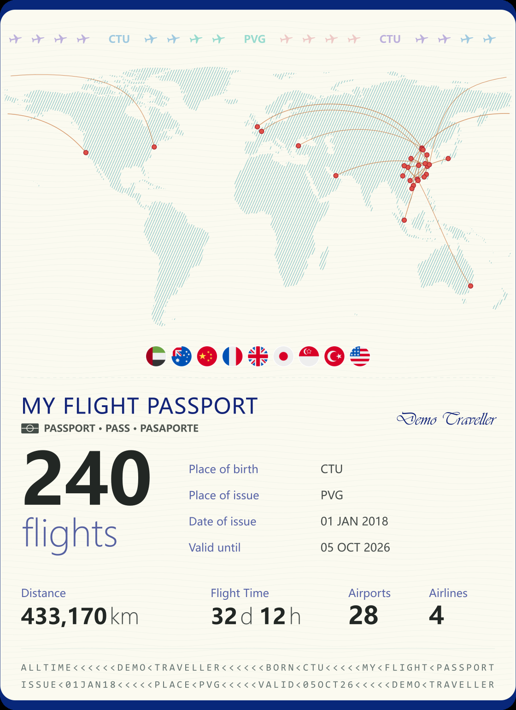
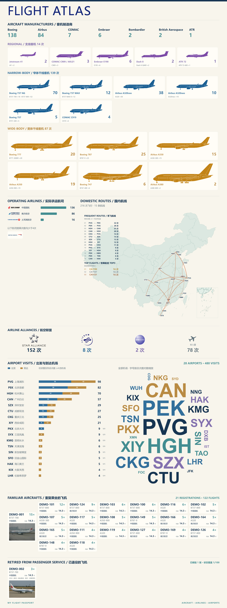

<h1 align="center">FlightAtlas</h1>

用航旅纵横的飞行记录，生成可更新的飞行护照与统计图。

  <a href="#报告效果">报告效果</a> ·
  <a href="#快速开始">快速开始</a> ·
  <a href="#可以调整什么">可选设置</a> ·
  <a href="plugins/flight-atlas/docs/data-extraction.md">数据提取教程</a> ·
  <a href="https://www.github.com/h15teve/FlightAtlas">GitHub</a>

## 报告效果

- **MY FLIGHT PASSPORT**：护照样式，展示世界航线、飞行次数、里程、时长和机场数量。
- **FLIGHT ATLAS**：展示制造商与机型、航司与联盟、国内航线、常乘航班、机场统计，以及可选的飞机卡片。

内置28族飞机图标。以后增加飞行记录，更新数据后即可重新生成。

<table>
  <tr>
    <td width="66%" valign="top" align="center"><strong>MY FLIGHT PASSPORT</strong> </td>
    <td width="34%" valign="top" align="center"><strong>FLIGHT ATLAS</strong> </td>
  </tr>
</table>

点击图片查看大图。示例为重新随机化的240次演示飞行，统计阈值 ≥4，两个飞机卡片栏目均开启；不是作者的真实行程。照片用于演示卡片布局，不对应图中的虚构注册号和状态。图片[素材来源及许可](plugins/flight-atlas/docs/previews/provenance.json)单独记录。

示例飞机照片：Aeroprints.com / CC BY-SA 3.0；两张合成效果图：CC BY-SA 4.0。品牌标志用于识别航司与联盟，不表示合作或背书。

公开 DEMO 的国航使用无汉字的 AIR CHINA 标志，这是示例的特例；生成用户报告时，中国大陆航司仍优先选用含中文名称的完整 LOGO。

## 快速开始

### 1. 安装

把下面这句话发给 Codex：

> 请安装 https://www.github.com/h15teve/FlightAtlas 中的 FlightAtlas 插件，并检查 flight-report 技能可以使用。

根据 Codex 提示完成安装确认，必要时重新打开会话。

### 2. 准备飞行数据

在航旅纵横中进入 **我 → 全部 → 特色服务 → 小横智能助手**，发送[提取提示词](plugins/flight-atlas/skills/flight-report/references/extraction-prompt.txt)，将输出保存为 CSV。

[图文教程](plugins/flight-atlas/docs/data-extraction.md)包含完整提示词、入口截图、保存方法和输出截断后的续传步骤。处理时保持手机亮屏，不离开小横页面；也可以直接把导出的 CSV 文本交给 Codex 保存。

**CSV 是报告的主要数据源。** 可另从 **行程 → ⋯ → 导出航班行程** 导出 XLS，交给 Codex 辅助核对。XLS 是可选的，不与 CSV 重复计数。

还没有 CSV？直接告诉 Codex“我还没有导出数据”，它会提供提取教程。

### 3. 生成报告

上传 CSV，告诉 Codex：

> 使用 $flight-report 生成我的飞行报告，先带我选择里程口径、展示栏目和统计阈值。

也可以在技能选择器中选择 **flight-report**，或直接说“用 FlightAtlas 生成我的飞行报告”。

Codex 会询问报告选项、护照字段与签名，检查数据，并协助查找缺失的航司 LOGO 和飞机照片，由你选择采用。完成后获得两张 PNG、可缩放的 SVG 和统计核验文件。

## 可以调整什么

不需要手写配置。告诉 Codex 你的偏好，它会解释选项并记录选择；以后也可以用自然语言修改。

### 里程怎么算

这项选择决定护照页的**累计飞行里程**。

| 选择 | 怎么处理 | 适合什么情况 |
| --- | --- | --- |
| 航旅纵横原值 | 使用 CSV 中的公里数，缺失项先请你补充 | 希望与自己的航旅纵横数据保持一致 |
| 全部使用 IATA TPM | 按城市对查询票价计算里程，再换算成公里；例如 PEK/PKX 都按北京城市口径 | 希望所有航段使用统一的城市里程口径 |
| 原值优先，缺失查询 TPM | 已有公里数不变，只查询空缺航段 | 想保留原记录，同时补齐缺失里程 |

TPM 不是实际飞行轨迹长度。免费查询使用 JAL 公布的区间里程；Codex 会展示查询结果供你确认，具体依据见[里程说明](plugins/flight-atlas/skills/flight-report/references/data-integrity.md)。

### 要不要展示飞机卡片

这两项决定统计图下方是否增加栏目，可分别开启或关闭。

| 栏目 | 会看到什么 | 需要什么信息 |
| --- | --- | --- |
| 重复乘坐的飞机 | 按注册号统计搭乘次数，展示型号、航司和机龄；搭乘最多的一架加照片 | 注册号；机龄需要首次交付日期，照片需核对机体序列号（MSN） |
| 已退出客运的飞机 | 展示曾经搭乘、后来永久退出客运服务的飞机，包含退役/改货等状态和照片 | 注册号与机体序列号（MSN）、退出客运的可靠记录和照片 |

例如，不感兴趣可以说“关闭退出客运栏目”。需要补资料时，Codex 会询问你自行提供还是让它查询，再由你选择采用；停场或查不到 ADS-B 记录不等于退役。

### 柱状图和常飞航线列多少项

**阈值是进入展示列表的最低次数，不会删掉飞行记录，也不会减少总次数、总里程或总时长。** 默认 ≥3，可以分别设置：

| 设置 | 示例：设为 ≥4 |
| --- | --- |
| 航司柱图 | 只画乘坐至少4次的航司；不足4次的航司仍在下方 LOGO 区展示 |
| 机场柱图 | 只画出发次数加到达次数至少4次的机场；所有机场仍保留在词云里 |
| 常飞航线 | 只列至少飞过4次的单向航线；PEK→PVG 与 PVG→PEK 分开统计 |

重复飞机卡片有独立的最低搭乘次数，默认 ≥2，也可以调整。常乘航班号始终展示 TOP3，不受上述航线阈值影响。

### 护照字段和签名

生成前，Codex 会展示默认值，请你确认或修改出生地、签发地和签发日期；签名自行选择，有效期至随生成日期刷新。这些是纪念报告字段，不是证件信息。

| 字段 | 默认值 |
| --- | --- |
| Place of birth（出生地） | 第一次飞行的出发机场三字码 |
| Place of issue（签发地） | 出发与到达总次数最多的机场三字码 |
| Date of issue（签发日期） | 第一次飞行日期 |
| Valid until（有效期至） | 本次生成日期，更新报告时自动刷新 |
| 签名 | 默认不添加；可提供姓名，显示为花体签名 |

飞行总时长默认累计 CSV 的**实际飞行时长**；某条缺失时，使用该条的表定飞行时长，并在核验文件中记录。

例如，你可以直接说：

> 原表里程优先，缺失再查 TPM；两个飞机栏目都开启；航司和机场柱图 ≥4，单向航线 ≥5；重复飞机 ≥2；签发地用 PVG，签名用 Alex Morgan。

## 更新报告

支持全量或增量更新。有新航班后，可以只导出指定时间范围的新增记录：将小横提示词的**第一句话**替换为范围要求，其他内容保持不变，见[增量提取示例](plugins/flight-atlas/docs/data-extraction.md#incremental-export)。

把新增 CSV 交给 Codex，说“将这些新记录增量合并到上次报告，沿用上次选项”。首次生成后请保留本地报告目录，其中的 `flight-history.json` 保存已有记录，`report-config.json` 保存选项。Codex 会检查重叠记录、列出冲突，并按合并后的全部历史重新生成两张图，不重复累计。旧版报告没有历史文件时，提供上次完整 CSV 和配置即可初始化；仅有效果图无法恢复历史记录。

同时保留配置引用的本地 LOGO、照片、签名及 TPM 缓存，不要只拷贝两个 JSON 后删除素材。原表和旧报告保留，历史与配置文件只存本地，不提交到公共仓库。

## 进一步阅读

- [数据提取教程](plugins/flight-atlas/docs/data-extraction.md)：面向用户，含插图和完整提示词。
- [Agent 操作指南](plugins/flight-atlas/docs/agent-guide.md)：面向 Codex，含安装、数据准备、核验与生成流程。
- [开发与 CLI](plugins/flight-atlas/docs/development.md)：环境安装、命令行、测试与打包。
- [素材及许可](plugins/flight-atlas/ASSET_NOTICES.md)：代码 MIT，第三方素材分别记录许可。

请将个人行程和生成报告保存在自己的工作目录，不提交到公共仓库。
