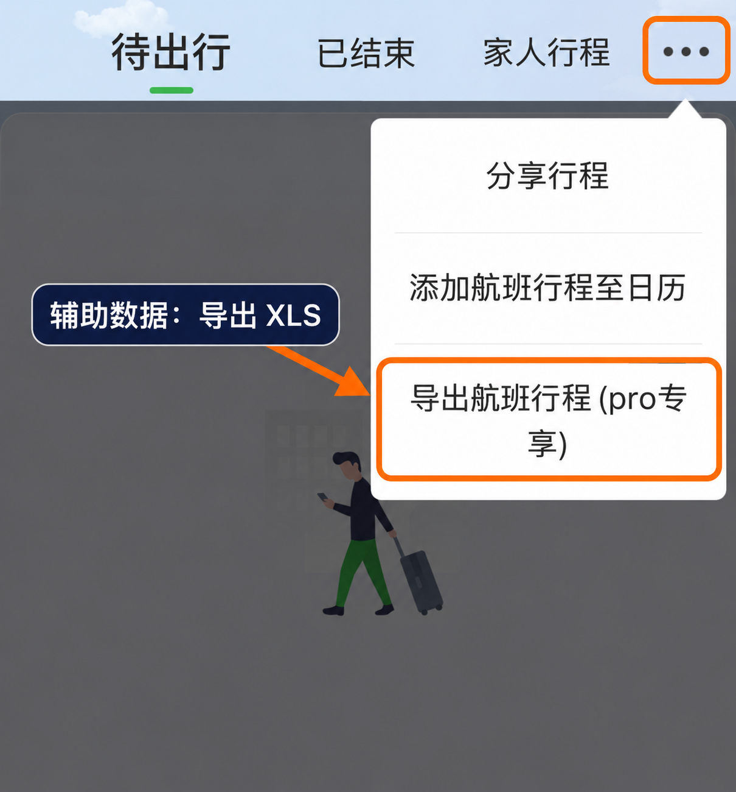

# 从航旅纵横提取飞行记录

这份教程面向准备生成报告的用户。先提取 CSV；如果需要核对记录，再补充航旅纵横导出的 XLS。

## 1. 打开小横智能助手

依次进入 **我 → 全部 → 特色服务 → 小横智能助手**。下面的截图标出了入口和输入位置。

<p>


</p>

## 2. 发送提取提示词

复制下方完整提示词，发送给小横。也可以打开[纯文本版](../skills/flight-report/references/extraction-prompt.txt)复制。

<details>
<summary>展开完整提取提示词</summary>

<!-- extraction-prompt:start -->
```text
请导出我乘坐过的全部航班，输出为【逗号分隔CSV】，可直接复制保存为 .csv。

【表头，共19列，列序固定，禁止调整】
日期,航班号,是否共享航班,出发机场,到达机场,表定出发,实际起飞,表定到达,实际降落,表定飞行时长,实际飞行时长,里程(公里),机型,注册号,舱位等级,座位号,含税票价,登机方式,下机方式

【时区约定】
所有时间字段一律采用各机场当地时间：表定/实际起飞 = 出发机场当地时间，表定/实际降落 = 到达机场当地时间；跨时区国际航班禁止混用北京时间。表定飞行时长和实际飞行时长全表统一为「X小时X分」，例如「2小时30分」「0小时35分」「2小时0分」；小时、分钟均为整数，分钟范围0–59，缺失填"-"，禁止混用小数小时、HH:mm或纯分钟数。

【取值规则】（每个字段只允许一个来源字段，禁止用「或」连接两个来源）
- 日期、航班号、出发机场、到达机场、表定出发、表定到达：用【历史行程列表】直接取（分页，每页30条，拉全量，禁止缩到近1年/30天）。出发机场和到达机场取三字码。
- 表定飞行时长：用【历史行程列表】中表定起降事件的完整日期和时间，按各机场在该事件日期的当地时区（含夏令时）换算为UTC后，以表定到达UTC日期时间 − 表定出发UTC日期时间计算，使用Python执行。禁止直接相减两个机场的当地时刻，也禁止统一套用“跨天 +24h”；起降日期、跨日关系或时区信息无法可靠确定时填"-"，禁止猜测。
- 是否共享航班：用【航班号日期查询】的 是否主飞航班 字段——是否主飞航班=true 填「否」，是否主飞航班=false 填「是」；未返回填"-"，禁止凭 共享航班的主航班号列表 推断。
- 实际起飞、实际降落、里程、登机/下机方式：用【航班号日期查询】（入参 航班号+日期）取实际起飞时间、实际到达时间、totalFlyMileage、isDeptBus/isDestBus（false=廊桥，true=摆渡车，缺失留空）。
- 实际飞行时长：用【航班号日期查询】中实际起降事件的完整日期和时间，按各机场在该事件日期的当地时区（含夏令时）换算为UTC后，以实际降落UTC日期时间 − 实际起飞UTC日期时间计算，使用Python执行。禁止直接相减两个机场的当地时刻，也禁止统一套用“跨天 +24h”；实际起降缺失，或起降日期、跨日关系、时区信息无法可靠确定时填"-"，禁止猜测。
- 机型、注册号：用【执飞机型查询】（入参 航班号+日期+出发三字码+到达三字码）取机型、飞机注册号。
- 舱位等级：只用【行程详情】返回的 舱位等级 字段原样输出单字母（如 Y/B/E/Q/N/P/W/R/Z/T/O）， 不做换算、不填中文、不推断「经济舱/公务舱/头等舱」等大舱位等级；舱位等级 为空或 "--" 时填 "-"。
- 座位号：只用【行程详情】返回的 座位号 字段原样输出；有效座位号照实填写，为空或 "--" 填 "-"，禁止编造。
- 含税票价 = 票面价 + 燃油费 + 民航发展基金，三者相加，禁止单独直接取 含税票价。
  三个来源字段均取自【行程详情】返回的 票价详情 子结构：
    · 票面价   = 票价详情.机票价格
    · 燃油费   = 票价详情.燃油费
    · 民航发展基金 = 票价详情.民航基金
  金额为纯数字列（去掉 "CNY" 等币种后缀），例如 "860CNY" → 860。
  三个字段任一为 "--" 或缺失时，该趟票价一律留空填 "-"，禁止用部分字段凑数，禁止用 含税票价 顶替。
  求和必须用 命令执行 执行 Python 计算，禁止心算。

【重试规则】
- 仅当「接口调用失败」或「接口成功返回、但目标字段确实不存在」时，重试 2 次；重试后仍无结果填"-"。

【格式与校验规则】
- 每个字段只允许一种输出形态：中文列只填中文、字母列只填字母、数字列只填数字、空值统一填"-"。
- 分批采集时，每个子任务必须自含「日期/航班号/起降三字码」，只回传【无表头 CSV 片段】，字段顺序与全表一致。
- 全部批次回传后，主控必须做列级校验：总行数=历史行程的实际全量条数、无重复、每行列数一致=19、各列格式统一；校验不通过不得交付。

【执行要求】
- 覆盖全部历史行程，按日期倒序。
- 禁止编造航班号、票号、价格、机型、注册号；禁止用其他航班顶替缺失数据。
```
<!-- extraction-prompt:end -->

</details>

处理时保持手机亮屏，不离开小横页面。飞行时长的计算规则已包含在提示词中，无需另外要求小横计算总时长。

<a id="incremental-export"></a>

### 只导出指定时间范围（增量更新）

后续更新不必重新导出全部记录。**只替换上面提示词的第一句话，其他内容原样保留。** 例如：

> 请导出我在2026年10月1日至2026年10月31日（按出发机场当地出发日期，含起止日期）乘坐过的全部航班，后文的“全部历史行程”和“全量”均仅指此范围，输出为【逗号分隔CSV】，可直接复制保存为 .csv。

将日期改成你需要的范围。首句限定了后文“全部历史行程”的范围，19列表头、时长计算和其他要求都不变。保存为新的 CSV，交给 Codex 增量合并到上次报告。范围可以与上次导出稍有重叠，插件会检查重复和差异；核对本次范围内的记录数，不要求它等于累计飞行总数。

## 3. 保存 CSV

将输出代码块中的表头和数据行保存为 UTF-8 编码的 `.csv` 文件，不包含代码块标记和小横的解释文字。

如果不方便保存文件，可以把完整 CSV 文本交给 Codex，让它保存并检查。多段输出也可以一起提供。

### 输出中途截断怎么办

找到最后一条完整记录，复制这条记录的日期、航班号、出发/到达机场和表定出发时间作为定位信息，再发送：

> 请继续输出 CSV，从最后一条完整记录之后开始，不重复表头和已输出记录。最后一条完整记录为：〈粘贴定位信息〉。如果上一段末尾有残缺行，请重新输出该行。

把所有段落交给 Codex 拼接。生成报告前，Codex 会检查每行是否为19列、是否有重复记录，并与你核对总次数。

## 4. 可选：导出 XLS 辅助核对

在 **行程 → ⋯ → 导出航班行程** 导出 XLS，一并交给 Codex。截图中的入口标有 PRO 专享，以你当前 APP 显示为准。



**CSV 是主要数据源，XLS 用于辅助印证。** XLS 的信息不会被重复计入飞行次数；若两个文件的同一航段有差异，Codex 会列出差异，交给你确认。

## 5. 交给 FlightAtlas

提供 CSV（以及可选 XLS），告诉 Codex：

> 使用 $flight-report 生成我的飞行报告，先带我选择里程口径、展示栏目和统计阈值。

后续更新时，可以提供最新全量 CSV，也可以只提供新增范围 CSV 并要求增量更新。请保留上次报告的 `flight-history.json`、`report-config.json`，以及配置引用的本地素材与 TPM 缓存；旧报告没有这些文件时，提供上次完整 CSV 和配置。个人数据保存在自己的工作目录，不放入公开仓库。

[返回 README](../../../README.md)
